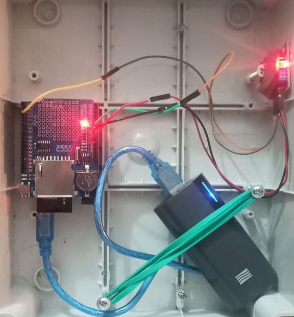

# AeroLogger

Device for tracing air in caves.
It detects very well the butane present in normal air freshener cans.

### components required for assembly (AeroLogger NASO):
* 1 ArduinoUNO
* 1 PowerBank
* 1 Data Logger Shield with RTC
* 1 MQ-2 sensor (GPL, butane, hydrogen, gas, Smoke)
* 1 Box
* connecting wires

### optionally it is possible to add sensor for temperature, humidity, pressure and wind speed:
* 1 GY-BMP280-3.3
* 1 Wind sensor 

### optionally VOC Sensor SGP40:
* 1 Digital SGP40 VOC (Volatile Organic Compounds) Gas Sensor 

-----

Logs are saved on csv files
the interval of each measurement can be set via the CONFIG.INI file that is created at the first start, or by connecting the device via USB

