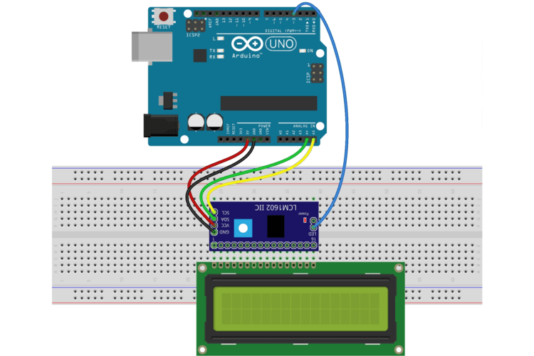

# Guida Completa di Assemblaggio FluxyLogger NASO

Guida per l'assemblaggio delle configurazioni NASO e NASO+LCD del FluxyLogger per tracciamenti aerei in grotta.

---

## Indice

- [Configurazione NASO Base](#configurazione-naso-base)
- [Configurazione NASO+LCD](#configurazione-nasolcd)
- [Caricamento Firmware](#caricamento-firmware)
- [Test Funzionale](#test-funzionale)
- [Risoluzione Problemi](#risoluzione-problemi)

---

## Configurazione NASO Base

### Componenti Necessari

1. Arduino UNO (o Arduino UNO WiFi R4)
2. Data Logger Shield con RTC DS1307
3. Sensore MQ-2 (gas combustibili)
4. MicroSD Card (formattata FAT32)
5. Batteria CR1220 per RTC
6. PowerBank USB (minimo 10000mAh)
7. Cavo USB tipo A-B
8. Box contenitore
9. Cavetti Dupont maschio-femmina

### Schema Collegamenti NASO Base


**Tabella Collegamenti Sensore MQ-2:**

| Pin MQ-2 | Collegamento Shield |
|----------|---------------------|
| VCC      | +5V                 |
| GND      | GND                 |
| AOUT     | A0                  |
| DOUT     | Non collegato       |

### Assemblaggio NASO Base

#### 1. Preparazione Shield

- Inserire batteria CR1220 nel Data Logger Shield
- Inserire microSD formattata (FAT32) nello slot

#### 2. Montaggio Shield su Arduino

- Allineare e inserire il Data Logger Shield su Arduino UNO
- Verificare che tutti i pin siano correttamente inseriti

#### 3. Collegamento Sensore MQ-2

**Con Arduino spento:**

- **VCC sensore → +5V shield** (cavo rosso)
- **GND sensore → GND shield** (cavo nero)
- **AOUT sensore → A0 shield** (cavo giallo/verde)


#### 4. Posizionamento nel Box

1. **Arduino+Shield:** fissare nel box con spugna/gommapiuma
2. **Sensore MQ-2:** deve rimanere esposto all'aria esterna, farlo uscire dal box
3. **Cavo USB:** praticare foro e sigillare con silicone

**Consumo:** ~210 mA
**Autonomia:** ~48-72 ore con PowerBank 10000mAh

---

## Configurazione NASO+LCD

### Componenti Aggiuntivi

Oltre ai componenti base NASO:

1. Display LCD 16x2 I2C (con modulo I2C integrato)
2. Pulsante momentaneo (opzionale, per controllo retroilluminazione)
3. Box contenitore trasparente

### Schemi Collegamenti NASO+LCD

#### Schema Sensore MQ-2


#### Schema Display LCD I2C



*Versione alternativa:*


### Tabelle Collegamenti NASO+LCD

**Sensore MQ-2:**

| Pin MQ-2 | Collegamento Shield |
|----------|---------------------|
| VCC      | +5V                 |
| GND      | GND                 |
| AOUT     | A0                  |

**Display LCD I2C:**

| Pin LCD I2C | Collegamento Shield |
|-------------|---------------------|
| VCC         | +5V                 |
| GND         | GND                 |
| SDA         | A4 (SDA)            |
| SCL         | A5 (SCL)            |

**Pulsante Retroilluminazione (opzionale):**

| Componente  | Collegamento      |
|-------------|-------------------|
| Pin 1       | +5V               |
| Pin 2       | Digital Pin 8 (D8)|

**Nota:** Il firmware attiva il pull-up interno su D8, non serve resistenza esterna.


### Assemblaggio NASO+LCD

#### 1-2. Preparazione e Montaggio Shield

Come per NASO base (punti 1 e 2)

#### 3. Collegamento Sensore MQ-2

Come per NASO base (punto 3)

#### 4. Collegamento Display LCD I2C

**Con Arduino spento:**

- **VCC display → +5V shield** (cavo rosso)
- **GND display → GND shield** (cavo nero)
- **SDA display → A4 shield** (cavo blu/verde)
- **SCL display → A5 shield** (cavo giallo/bianco)

**Nota:** Indirizzo I2C tipicamente 0x27 o 0x3F (rilevato automaticamente dal firmware)

#### 5. Collegamento Pulsante (opzionale)

Se si desidera controllo manuale della retroilluminazione:

- Un terminale → +5V
- Altro terminale → D8

**Schema:**

```text
+5V ----[Pulsante]---- D8
```

**Nota tecnica:** Il firmware attiva il pull-up interno su D8, quindi non serve resistenza esterna.

**Funzionamento:** Pressione > 1 sec accende/spegne retroilluminazione

**Senza pulsante:** La retroilluminazione rimane sempre accesa

#### 6. Verifica Collegamenti Completa

- [ ] Nessun cortocircuito VCC/GND
- [ ] Sensore: AOUT su A0
- [ ] LCD: SDA su A4, SCL su A5
- [ ] Pulsante: +5V su un terminale, D8 sull'altro (se installato)
- [ ] MicroSD e batteria RTC installati

#### 7. Posizionamento nel Box

1. **Display:** montare sulla parete trasparente del box (biadesivo o viti)
2. **Arduino+Shield:** fissare sul fondo
3. **Sensore MQ-2:** deve rimanere esposto all'aria esterna, farlo uscire dal box
4. **Pulsante (se installato):** verificare accessibilità dall'esterno
5. **Cavi:** evitare tensioni sui collegamenti I2C

#### 8. Regolazione Contrasto Display

Se il display non è leggibile:

- Ruotare il trimmer blu sul modulo I2C con cacciavite piccolo
- Regolare fino a ottenere contrasto ottimale

### Utilizzo Display

**Durante acquisizione:**

```
ADC:0125 PPM:045
16:32 Det:0003
```

- **ADC:** Valore grezzo sensore (0-1023)
- **PPM:** Parti per milione
- **HH:MM:** Ora corrente
- **Det:** Rilevamenti positivi consecutivi

**Consumo:** ~275 mA (con LCD retroilluminato)
**Autonomia:** ~36-48 ore con PowerBank 10000mAh

---

## Caricamento Firmware

### Preparazione Arduino IDE

1. Installare Arduino IDE da [arduino.cc](https://www.arduino.cc/en/software)
2. Collegare Arduino al PC via USB
3. Selezionare: **Tools → Board → Arduino UNO**
4. Selezionare porta: **Tools → Port → COMx** (Windows) o **/dev/ttyACMx** (Linux)

### Librerie Necessarie

Installare via **Tools → Manage Libraries:**

**Per NASO base:**
- RTClib (by Adafruit)
- SD (built-in)

**Per NASO+LCD aggiungere:**
- LiquidCrystal_I2C (by Frank de Brabander)

### Caricamento Sketch

1. Scaricare firmware: [FluxyLogger.ino](https://github.com/speleoalex/opsdatalogger/blob/main/FluxyLogger/FluxyLogger.ino)
2. Aprire file `.ino` con Arduino IDE
3. **Per NASO+LCD:** verificare che nel codice sia abilitato `#define LCD_ENABLED`
4. Cliccare: **Sketch → Verify/Compile**
5. Cliccare: **Sketch → Upload**
6. Attendere: "Done uploading"

### Prima Configurazione

1. Aprire: **Tools → Serial Monitor**
2. Baud rate: **19200**
3. Seguire istruzioni per configurazione iniziale

---

## Test Funzionale

### Test Iniziale

**Collegamento Seriale:**

- USB → PC
- Seriale: 19200 baud
- Monitor: Arduino IDE o webapp [https://applications.techmakers.it/datalogger/terminal.htm](https://applications.techmakers.it/datalogger/terminal.htm)

**Verifica Inizializzazione:**

- LED lampeggiano durante preriscaldamento (~30 sec)
- Valori ADC si stabilizzano (10-150)
- Nessun errore SD card/RTC

**Configurazione Data/Ora:**

```text
settime 2025-01-24 14:30:00
```

**Calibrazione NASO:**

```text
autocalib
```

Attendere 30 secondi, poi:

```text
setcalib
```

### Test Sensore MQ-2

- Spray deodorante vicino sensore
- Valori ADC/PPM aumentano significativamente
- Display LCD (se presente) aggiorna valori in tempo reale

### Verifica MicroSD

**Durante acquisizione:**

```text
test
```

Output atteso: `OK writing to SD`

**Test da spento:**

- Rimuovere microSD
- Inserire in lettore PC
- Verificare file CSV con data corrente
- Aprire con editor testo/Excel
- Colonne e timestamp corretti

### Verifiche Display LCD (NASO+LCD)

- [ ] Display mostra versione firmware all'avvio
- [ ] Valori ADC/PPM si aggiornano in tempo reale
- [ ] Ora corretta
- [ ] Pulsante retroilluminazione funziona (pressione > 1 sec)
- [ ] Contrasto leggibile

**Se caratteri illeggibili:** ruotare trimmer blu sul modulo I2C

---


## Documentazione Correlata

**Guide di Assemblaggio:**

- [Guida Assemblaggio NASO (IT)](NASO_assembly_complete_guide_it.md) - Questo documento
- [NASO Assembly Guide (EN)](NASO_assembly_complete_guide_en.md)
- [Guida Assemblaggio METEO/VOC (IT)](METEO_VOC_assembly_guide_it.md)
- [METEO/VOC Assembly Guide (EN)](METEO_VOC_assembly_guide_en.md)

**Manuali Utente:**

- [Manuale Utente NASO (IT)](../../manuals/FluxyLogger-NASO-it.md)
- [NASO User Manual (EN)](../../manuals/FluxyLogger-NASO-en.md)
- [Manuale Utente NASO+LCD (IT)](../../manuals/FluxyLogger-NASO_lcd-it.md)
- [NASO+LCD User Manual (EN)](../../manuals/FluxyLogger-NASO_lcd-en.md)

**Altro:**

- [Aggiornamento Firmware (IT)](../../manuals/UpdateFirmware_it.md)
- [Firmware Update (EN)](../../manuals/UpdateFirmware_en.md)
- [Lista Componenti](../components.md)
- [Platform Overview (IT)](../../FluxyLogger-Platform-Overview-it.md)
- [Platform Overview (EN)](../../FluxyLogger-Platform-Overview-en.md)

---


## Supporto

- **Telegram:** [https://t.me/+u5CoELQNjC1iODZk](https://t.me/+u5CoELQNjC1iODZk)
- **GitHub:** [https://github.com/speleoalex/opsdatalogger/issues](https://github.com/speleoalex/opsdatalogger/issues)
- **Email:** speleoalex@gmail.com

---

**Progetto FluxyLogger**
**Versione:** 1.0 - Gennaio 2025
**Licenza:** GNU General Public License
**Autore:** Alessandro Vernassa
