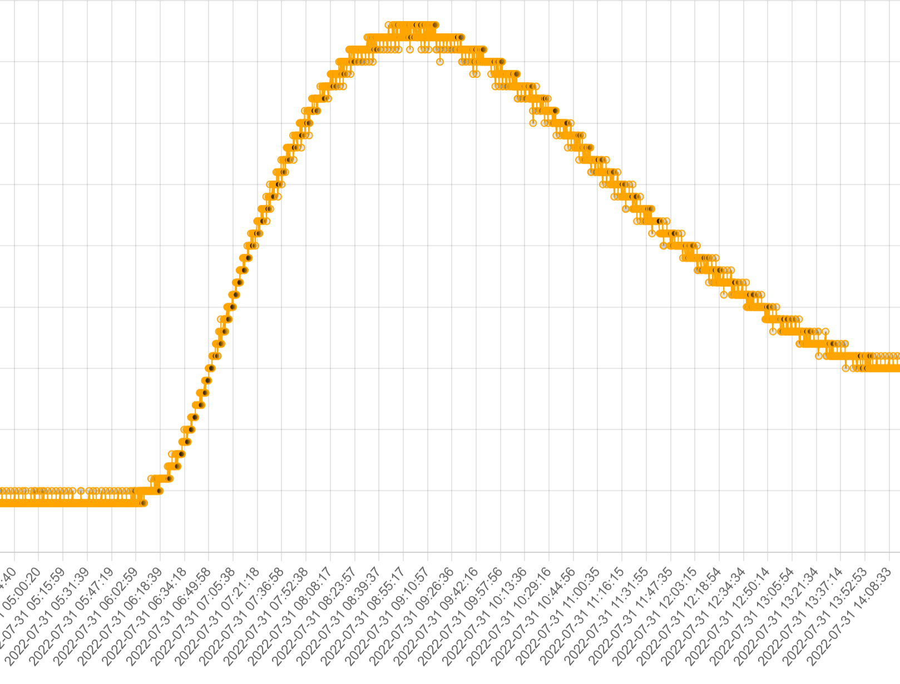

# FluxyLogger NASO


The N.A.S.O. (Novel Aereal Sensing Observer) datalogger aims to verify the presence of connections between two cavity inputs through air tracing.

The tracer is introduced into a suction inlet and the datalogger in a blowing inlet.

The datalogger records the passage of the tracer and saves the acquired data on a microSD card.

[https://techmakers.eu/products/n-a-s-o-data-logger](https://techmakers.eu/products/n-a-s-o-data-logger)

-----

# List of Components


# How to Start Recording

- Connect the device via the USB port to a powerbank.
- The two LEDs on the datalogger will flash for a few seconds alternately.
- After that, the acquisition will start.
- The default acquisition time is 15 seconds.
- Data will be saved in files on the SD card. The file name corresponds to the date and time of the start of acquisition.
- In case of SD card read/write error, led1 and led2 will remain steadily on.

# Tracer

As a tracer, any spray deodorant based on propane or butane can be used.
The detector is also sensitive to alcohol, methane, smoke.
The amount of tracer required may vary depending on the air volumes.
For distances over a kilometer, it is advisable to use at least 2 cans of 300ml tracer each.

# Preventing Environmental Impact During Tracing

This sensor is specifically designed to identify propellant gases such as butane and propane, common in spray cans. Compressed gas propellants are economically advantageous, inert, and characterized by low toxicity by inhalation, reducing environmental impact.

To further minimize environmental damage, the use of eco-friendly products is suggested.

It is also advisable to apply the contents of the cans on suitable surfaces, such as paper or fabric, rather than directly on rock or ground, to avoid leaving harmful residues in the environment.

 
# How to Change the Date and Time

### Connection from smartphone:
you can set the date and time with any terminal program that connects to the
USB port of the PC or by connecting it via adapter to the Smartphone using an app, for
example, "Serial USB Terminal" for Android devices.


### Connection from PC:
The Arduino IDE program has a built-in terminal accessible from the menu
Tools->Serial Monitor.
Set the USB port and the serial speed to 115200 baud

### Example of serial output:

```
D initialization:ok
CONFIG.INI exist
zerogas=89
Interval(s)=30
RTC present
Device clock:2023-11-17 17:15:28 type 'settime' to change
prehead
prehead
prehead
prehead
prehead
prehead
prehead
Log to:2023-11-17_17.16.02.txt
"date Y-m-d m:s" "gas adc" "LPG PPM"
"2023-11-17 17:16:02" 80 0
"2023-11-17 17:16:32" 80 0
"2023-11-17 17:17:02"

```


sending the command "help" is possible to have the list of possible commands.


### Setting the date and time:
Turn on the sensor by connecting it to the USB port and send the command **settime**

At this point it will sequentially ask for Year, Month, Day, Hour, Minutes.

After setting the date, data acquisition will automatically start and will be shown in real time.

with the device connected to the serial, it is possible at any time to reset the date and time by sending the command "settime"

## Automatic Calibration
- Connect the datalogger to a PC or smartphone in a place where there is no presence of tracer
- Send the command **autocalib**

Lights L1 and L2 flash in sync until calibration is complete.

*The device remains in calibration until it performs at least 20 consecutive readings. To interrupt calibration, turn off and restart the device*

## Setting Acquisition Time and Calibration

It is possible to modify the acquisition time or the calibration value "zerogas".
zerogas represents the raw value of the sensor when the air is free of tracer

- Connect the datalogger to a PC or smartphone in a place where there is no presence of tracer
- Send the command setconfig
- Enter interval in seconds or enter to keep the old value
- Enter the zerogas value or enter to keep the old value

## Data Download

- Data is written to files within the SD card. The files are named after the start date of the log. They can be opened with any spreadsheet. Set the field separator to ";"
- It is possible to download the data from a PC using **Google Chrome** or **MS Edge** via web application at: [https://applications.techmakers.it/datalogger/loggermanager.htm](https://applications.techmakers.it/datalogger/loggermanager.htm)
 Safari browser is not supported

## Data Interpretation

Depending on the detection curve, it is possible to deduce some characteristics of the cavity.

## Tracer Transit:


## Transit with Double Gallery:


## Transit with Passage in Landslide

