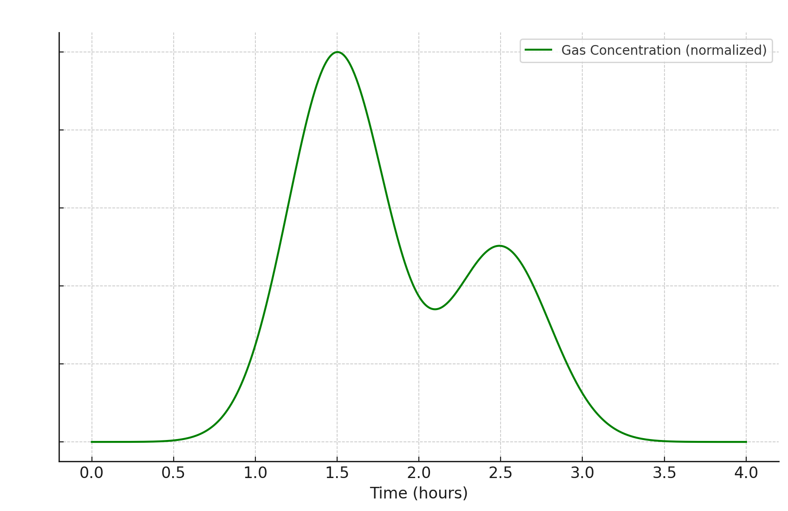
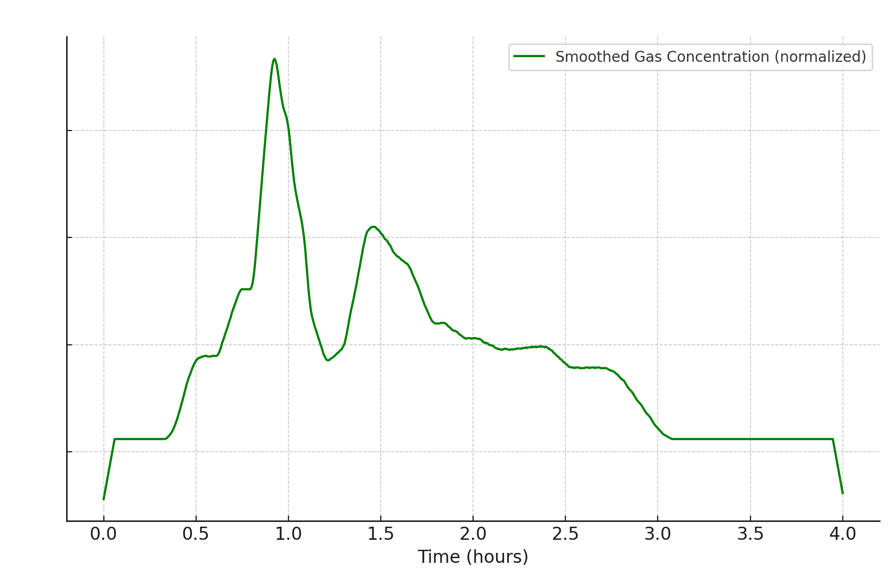

# FluxyLogger NASO


Il datalogger N.A.S.O. (Novel Aereal Sensing Observer) ha lo scopo di verificare la presenza di connessioni tra due ingressi di cavità tramite tracciamenti dell'aria.

Il tracciante viene immesso in un ingresso aspirante e il datalogger in un ingresso soffiante.

Il datalogger registra il passaggio del tracciante e salva i dati acquisiti su una scheda nicroSD


-----

# Elenco componenti


# Come avviare la registrazione

- collegare il dispositivo tramite la presa usb ad un powerbank.
- i due led sul datalogger lampeggeranno per qualche secondo alternandosi.
- Al termine partirà l'acquisizione.
- Il tempo di acquisizione predefinito è 15 secondi
- I dati verranno salvati su files all'interno della scheda SD. Il nome del file corrisponde alla data e all'ora di inizio acquisizione
- In caso di errore di lettura/scrittura della scheda SD led1 e led2 rimangono fissi accesi

# Tracciante

Come tracciante è possibile utilizzare qualsiasi deodorante Spray a base di propano o butano.
Il rilevatore è sensibile inoltre ad alcool, metano, fumo
La quantità di tracciante necessaria può variare a seconda dei volumi di aria.
Per distanze superiori al chilometro Si consiglia di utilizzare almeno 2 bombolette da 300ml di tracciante.


 
# Come modificare la data e l’ora

### Collegamento da smartphone :
puoi impostare la data e l’ora con un qualsiasi programma terminale che si collega alla porta
USB del PC oppure collegandolo tramite adattatore allo Smartphone utilizzando un’’app, per
esempio “Serial USB Terminal” per dispositivi Android.


### Collegamento da PC :
Il programma Arduino IDE ha un terminale integrato accessibile dal menu
Strumenti->Monitor seriale.
Impostare la porta USB e la velocità della seriale a 115200 baud

### Esempiodi output su seriale:
```
SD initialization:ok
CONFIG.INI exist
zerogas=89
Interval(s)=30
RTC present
Device clock:2023-11-17 17:15:28 type 'settime' to change
prehead 
prehead 
prehead 
prehead 
prehead 
prehead 
prehead 
Log to:2023-11-17_17.16.02.txt
"date Y-m-d m:s"	"gas adc"	"LPG PPM" 
"2023-11-17 17:16:02"	80	0
"2023-11-17 17:16:32"	80	0
"2023-11-17 17:17:02"	80	0
```

inviando il comando "help" è possibile avere la lista dei comandi possibili.


### Impostazione data e ora:
Accendere il sensore collegandolo alla porta USB ed inviare il comando **settime**

A questo punto chiederà in successione Anno, Mese, giorno, ora minuti.

Dopo aver impostato la data partirà automaticamente l’acquisizione dei dati e saranno
mostrati in tempo reale.

con dispositivo connesso alla seriale è possibile in qualsiasi momento reimpostare data e ora inviando il comando "settime"

## Calibrazione automatica
- Collegare il datalogger a pc o smartphone in un luogo dove non c'è presenza di tracciante
- Inviare il comando **autocalib**

Le luci L1 e L2 lampeggiano in sincronia fino a fine calibrazione.

*Il dispositivo rimane in calibrazione fino a che esegue almeno 20 letture consecutive. Per interrompere la calibrazione spegnere e riaccendere il dispositivo*

## Impostazione tempo di acquisizione e calibrazione

è possibile modificare il tempo di acquisizione o il valore di calibrazione "zerogas".
zerogas rappresenta il valore grezzo del sensore quando l'aria è in assenza di tracciante 

- Collegare il datalogger a pc o smartphone in un luogo dove non c'è presenza di tracciante
- Inviare il comando setconfig
- immettere intervallo in secondi o invio per mantenere il vecchio valore
- immettere il valore zerogas o invio per mantenere il vecchio valore

## Scaricamento dati

- I dati sono scritti su files all'interno della scheda SD. I files hanno come nome la data di inizio log. Possono essere aperti con qualsiasi foglio di calcolo. Impostare come separatore di campo ";"
- È possibile scaricare i dati da PC utilizzando **Google Chrome** o **MS Edge** tramite web application all'indirizzo: [https://applications.techmakers.it/datalogger/loggermanager.htm](https://applications.techmakers.it/datalogger/loggermanager.htm)
 il browser Safari non è supportato

## Interpretazione dei dati

a seconda della curva di rilevamento è possibile dedurre alcune caratteristiche della cavità.

## Transito tracciante:


## Transito con doppia galleria:


## Transito con passaggio in frana



