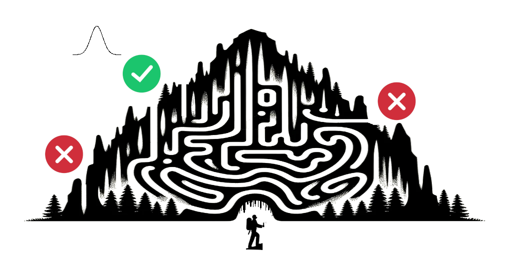
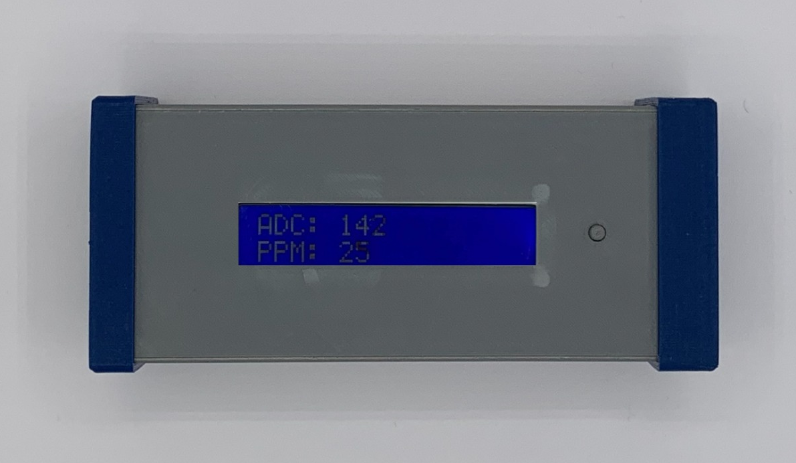
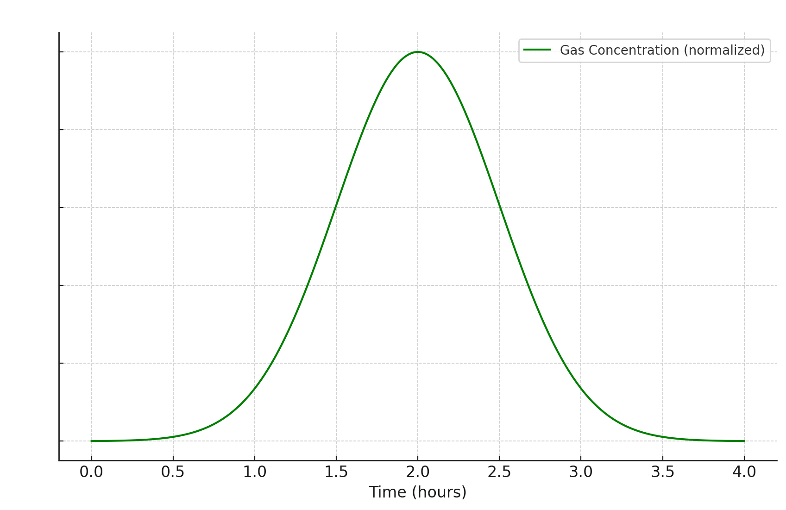
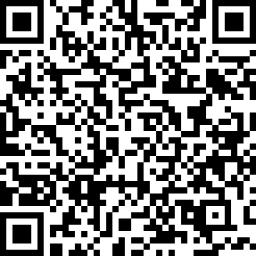

# FluxyLogger NASO #NASO4CAVE



Il datalogger N.A.S.O. (Novel Aereal Sensing Observer) ha lo scopo di verificare la presenza di connessioni tra due ingressi di cavità tramite tracciamenti dell'aria.

Usato in coppia può essere anche utilizzato per calcolare la velocità media dei flussi d'aria.

Il tracciante viene immesso in un ingresso aspirante e il datalogger in un ingresso soffiante.

Il datalogger registra il passaggio del tracciante e salva i dati acquisiti su una scheda nicroSD

[https://techmakers.eu/products/n-a-s-o-data-logger](https://techmakers.eu/products/n-a-s-o-data-logger)


Gruppo Telegram
[https://t.me/+u5CoELQNjC1iODZk](https://t.me/+u5CoELQNjC1iODZk)


-----

# Elenco componenti



1. Sensore
2. Micro SD
3. Porta usb/alimentazione
4. Pulsante retroilluminazione
5. Display

# Display

- Il display mostra i valori di ADC (valore del sensore) e PPM (quantità di gas calcolata in base al valore zerogas di riferimento ADC. Sono visualizzate inoltre il numero di acquisizioni positive consecutive.
- Premendo il tasto vicino al display per più di un secondo il display si accende


# Come avviare la registrazione

- Collegare il dispositivo tramite la presa usb ad un powerbank.
- Sul display comparte la versione del firmware per qualche secondo, quindi per circa 30 secondi viene avviata la fase di preriscaldamento del sensore. Sul display compare ora e data attuale con la scritta "Preheating".
- Al termine partirà l'acquisizione.
- Il tempo di acquisizione predefinito è 15 secondi
- I dati verranno salvati su files all'interno della scheda SD. Il nome del file corrisponde alla data e all'ora di inizio acquisizione
- In caso di errore di lettura/scrittura della scheda comparirà il messaggio "failed" per alcuni secondi
- Durante l'acquisizione vengono mostrati i valori ADC e PPM in tempo reale
- Sul display in alto a destra compare il numero di rilevamenti di gas positivi consecutivi. Il conteggio avviene dopo avere rilevato un valore maggiore di 10 ppm per almeno 20 volte consecutive.

# Tracciante

Come tracciante è possibile utilizzare qualsiasi deodorante Spray a base di propano o butano.
Il rilevatore è sensibile inoltre ad alcool, metano, fumo
La quantità di tracciante necessaria può variare a seconda dei volumi di aria.
Per distanze superiori al chilometro Si consiglia di utilizzare almeno 2 bombolette da 300ml di tracciante.


# Alimentazione e consumi

Fluxylogger può essere alimentato tramite cavo USB, è possibile utilizzare powerbank per la ricarica degli smartphones. I consumi sono di circa 275 mA all'ora.


# Impatto ambientale durante il tracciamento

Questo sensore è specificatamente progettato per identificare gas propellenti come butano e propano, comuni nelle bombolette spray. I propellenti a gas compressi sono economicamente vantaggiosi, inerti, e caratterizzati da bassa tossicità per inalazione, riducendo l'impatto ambientale. 

Per minimizzare ulteriormente l'impatto ambientale, si suggerisce l'utilizzo di prodotti ecocompatibili. 

È inoltre consigliabile applicare il contenuto delle bombolette su superfici idonee, quali carta o tessuto, anziché direttamente su roccia o terreno, per evitare di lasciare residui nocivi nell'ambiente.


 
# Come modificare la data e l’ora

### Collegamento da smartphone :
puoi impostare la data e l’ora con un qualsiasi programma terminale che si collega alla porta
USB del PC oppure collegandolo tramite adattatore allo Smartphone utilizzando un’’app, per
esempio “Serial USB Terminal” per dispositivi Android.


### Collegamento da PC :
Il programma Arduino IDE ha un terminale integrato accessibile dal menu
Strumenti->Monitor seriale.
Impostare la porta USB e la velocità della seriale a 19200 baud

### Esempio di output su seriale:

```
SD initialization:ok
CONFIG.INI exist
zerogas=89
Interval(s)=30
RTC present
Device clock:2023-11-17 17:15:28 type 'settime' to change
prehead 
prehead 
prehead 

Log to:2023-11-17_17.16.02.txt
"date Y-m-d m:s"	"gas adc"	"LPG PPM" 
"2023-11-17 17:16:02"	80	0
"2023-11-17 17:16:32"	80	0
"2023-11-17 17:17:02"	80	0
```
inviando il comando **help** è possibile avere la lista dei comandi possibili.

### Esempio di file generato su scheda microSD:


```
date Y-m-d m:s;gas adc;LPG PPM 
2022-07-31 00:02:43;35;0
2022-07-31 00:02:53;35;0
2022-07-31 00:03:03;35;0
2022-07-31 00:03:13;34;0
2022-07-31 00:03:23;34;0
2022-07-31 00:03:33;34;0
2022-07-31 00:03:43;34;0
2022-07-31 00:03:53;33;0
2022-07-31 00:04:03;33;0
2022-07-31 00:04:13;33;0
2022-07-31 00:04:23;33;0
2022-07-31 00:04:33;33;0
2022-07-31 00:04:43;33;0

```

i files vengono creati sulla scheda micrp SD con la **data di inizio** della registrazione, ad esempio **2023-09-18_22.13.00.txt** e contengono una tabella in formato csv con i valori registrati

#### Campi della tabella:

- date Y-m-d m: data
- gas adc: valore grezzo del sensore che va da 1 a 1024
- LPG PPM: parti per milione del gas assumendo che il tracciante sia propano o butano calcolato con il valore di zero gas impostato sul datalogger. In caso di valore di zero gas non corretto questo campo può essere calcolato anche a posteriori utilizzando il datasheet del sensore MQ-2
- Tenere sempre conto che la colonna "LPG PPM" potrebbe non essere reale perchè è calcolata partendo dal valore di zerogas impostato sul datalogger, considera sempre la colonna "gas adc" tenendo conto che nella fase iniziale c'è una curva dovuta al riscaldamento del dendore


### Impostazione data e ora:
Accendere il sensore collegandolo alla porta USB ed inviare il comando **settime**

A questo punto chiederà in successione Anno, Mese, giorno, ora minuti.

Dopo aver impostato la data partirà automaticamente l’acquisizione dei dati e saranno
mostrati in tempo reale.

con dispositivo connesso alla seriale è possibile in qualsiasi momento reimpostare data e ora inviando il comando "settime"

## Calibrazione automatica
- Collegare il datalogger a pc o smartphone in un luogo dove non c'è presenza di tracciante
- Inviare il comando **autocalib**

Le luci L1 e L2 lampeggiano in sincronia fino a fine calibrazione.

*Il dispositivo rimane in calibrazione fino a che esegue almeno 20 letture consecutive. Per interrompere la calibrazione spegnere e riaccendere il dispositivo*

## Impostazione tempo di acquisizione e calibrazione

è possibile modificare il tempo di acquisizione o il valore di calibrazione "zerogas".
zerogas rappresenta il valore grezzo del sensore quando l'aria è in assenza di tracciante 

- Collegare il datalogger a pc o smartphone in un luogo dove non c'è presenza di tracciante
- Inviare il comando setconfig
- immettere intervallo in secondi o invio per mantenere il vecchio valore
- immettere il valore zerogas o invio per mantenere il vecchio valore

## Scaricamento dati

- I dati sono scritti su files all'interno della scheda SD. I files hanno come nome la data di inizio log. Possono essere aperti con qualsiasi foglio di calcolo. Impostare come separatore di campo ";"
- È possibile scaricare i dati da PC utilizzando **Google Chrome** o **MS Edge** tramite web application all'indirizzo: [https://applications.techmakers.it/datalogger/loggermanager.htm](https://applications.techmakers.it/datalogger/loggermanager.htm)
 il browser Safari non è supportato

## Interpretazione dei dati

a seconda della curva di rilevamento è possibile dedurre alcune caratteristiche della cavità.

## Transito tracciante:


## Supporta il progetto

Se ritieni utile questo progetto, considera di supportarne lo sviluppo:

[](https://www.paypal.com/donate/?business=TKQWLKGENEP7L&no_recurring=0&item_name=Progetto+FluxyLogger+NASO&currency_code=EUR)